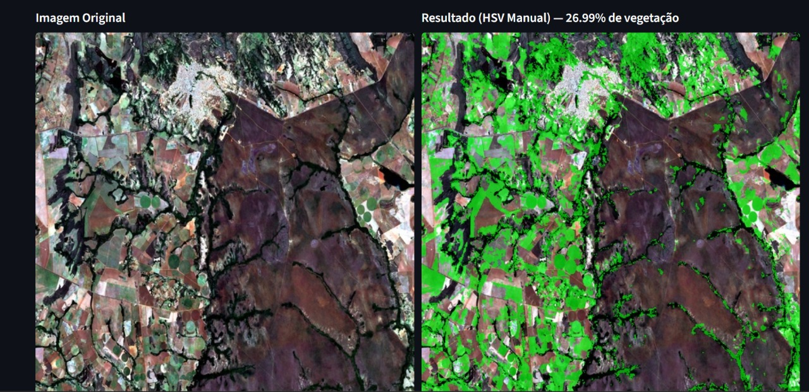
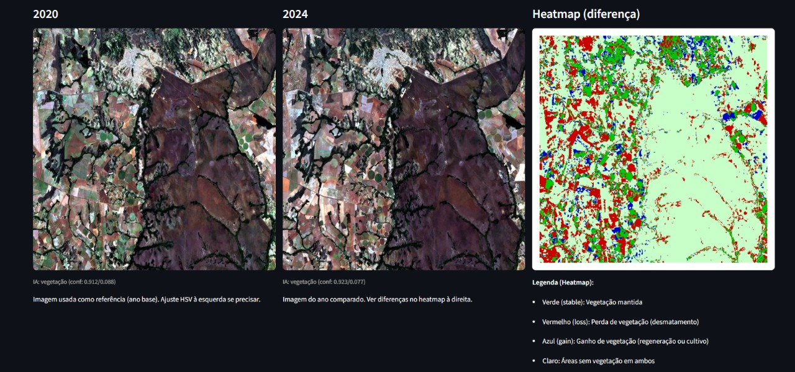
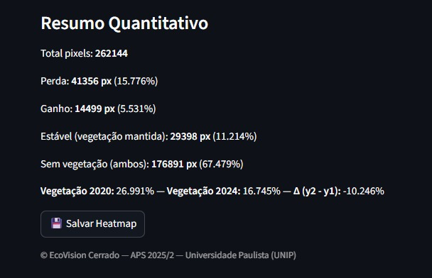

# 🌎 EcoVision Cerrado

**EcoVision Cerrado** é um projeto de **Visão Computacional** e **Inteligência Artificial** desenvolvido para detectar **vegetação e desmatamento** a partir de imagens de satélite Sentinel-2.  

> ⚠️ Embora o nome destaque o bioma *Cerrado*, o modelo de IA utilizado é **genérico** — treinado com o dataset **EuroSAT**, composto por imagens de diferentes regiões do mundo.  
> O **Cerrado** foi utilizado como **caso de estudo e aplicação prática**, servindo para avaliar o comportamento do modelo e dos métodos de análise multitemporal em um bioma real.

---

## 🧠 Objetivo do Projeto

Desenvolver uma ferramenta automatizada para **identificar mudanças ambientais e padrões de vegetação** ao longo do tempo, utilizando **análise multitemporal**, **máscaras espectrais (HSV e ExG)** e uma **IA pré-treinada** (ResNet18).

O projeto demonstra como **modelos genéricos de classificação de uso do solo** podem ser aplicados para **monitorar o Cerrado brasileiro**, destacando áreas de **desmatamento ou regeneração** entre diferentes anos (ex.: 2020 × 2024).

---

## 🚀 Tecnologias Utilizadas

| Categoria | Tecnologias |
|------------|--------------|
| **Linguagem** | Python 3.11 |
| **Frameworks** | Streamlit, PyTorch |
| **Bibliotecas** | OpenCV, NumPy, Pandas, scikit-image, tqdm, Pillow |
| **Modelo de IA** | ResNet18 (pré-treinada no dataset EuroSAT) |
| **Visualização** | Matplotlib, Streamlit |
| **Imagens base** | Sentinel-2 (Google Earth Engine) e EuroSAT |

---

## 🧩 Estrutura do Projeto

```bash
ecovision-cerrado/
├── app/
│   ├── rotulador.py                # Interface para rotular imagens manualmente
│   └── streamlit_app.py            # Dashboard principal (análise + IA)
│
├── data/
│   ├── multitemporal/              # Imagens do Cerrado (ex: 2020 × 2024)
│   ├── processed/                  # Imagens processadas do EuroSAT
│   └── raw/                        # Arquivos brutos (.tif)
│
├── outputs/
│   ├── overlays/                   # Máscaras HSV e ExG
│   ├── plots/                      # Heatmaps e gráficos
│   ├── model_cerrado_resnet18.pth  # Modelo treinado (PyTorch)
│   └── vegetation_report_final.csv
│
├── scripts/                        # Scripts utilitários e análises
│   ├── tif_to_jpg_512.py
│   ├── pair_and_process_multitemporal.py
│   ├── plot_heatmap_diff.py
│   ├── infer_single.py
│   ├── batch_infer.py
│   └── evaluate_and_report.py
│
├── src/
│   ├── preprocess.py
│   ├── hsv_mask.py
│   ├── utils.py
│   └── model/
│       └── train_model.py
│
├── .gitignore
├── requirements.txt
└── README.md
```
---

## 🧮 Funcionalidades Principais

### 🔹 1. **Análise Multitemporal (Cerrado como exemplo)**
- Compara imagens de **2020 × 2024**
- Gera **heatmaps de diferença** destacando:
  - 🟩 **ganho de vegetação**
  - 🟥 **perda de vegetação (desmatamento)**
  - 🟦 **áreas estáveis**

### 🔹 2. **Modelo de IA (ResNet18 — EuroSAT)**
- Modelo **pré-treinado** com imagens satelitais genéricas.
- Classifica as cenas em duas categorias:
  - 🌿 **vegetação**
  - 🌾 **desmatamento**
- O Cerrado foi usado apenas como **caso de aplicação**, demonstrando a **generalização da IA**.

### 🔹 3. **Dashboard Interativo (Streamlit)**
- Interface para:
  - Selecionar dataset (EuroSAT ou Cerrado)
  - Ajustar parâmetros HSV
  - Visualizar máscaras e heatmaps
  - Comparar anos lado a lado
  - Gerar relatórios e CSVs automaticamente

---

## 📊 Exemplo de Uso

### 🔧 Execução
```bash
cd ecovision-cerrado
.\.venv\Scripts\activate
streamlit run app/streamlit_app.py
```
## 🛰️ Exemplo de análise

### 🔹 1. Escolha Dataset → Cerrado

### 🔹 2. Selecione uma área (ex: area_002)

### 🔹 3. Compare 2020 × 2024

### 🔹 4. Veja lado a lado:

<p align="center">
  
</p>

<p align="center">
  
</p>

5. Resumo Quantitativo

> O painel abaixo mostra o **resumo automático** gerado pelo sistema, com o cálculo de pixels de **ganho, perda e manutenção da vegetação**, comparando os anos de 2020 e 2024.  
> Esses dados são obtidos diretamente do **Streamlit**, a partir da diferença entre máscaras de vegetação dos dois períodos analisados.

<p align="center">
  
</p>


### 🔹 5. Observe:

Percentual de perda/ganho de vegetação

Predição do modelo (vegetação ou desmatamento)

---


## 🧑‍💻 Autores

| Nome      | Função                                                   | GitHub                                                   |
| ---------- | -------------------------------------------------------- | -------------------------------------------------------- |
| **Higor**  | Desenvolvimento, pré-processamento, integração Streamlit | [@HigorPereira19](https://github.com/HigorPereira10) |
| **João**   | Treinamento da IA, rotulagem e inferência                | [@UsuarioDoJoao](https://github.com/UsuarioDoJoao)       |

